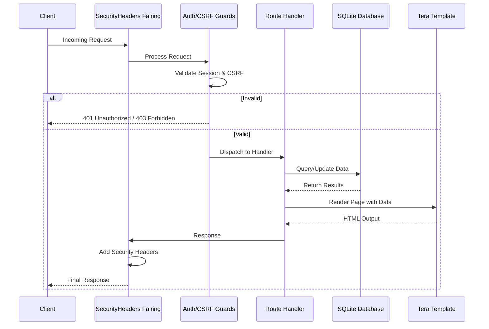
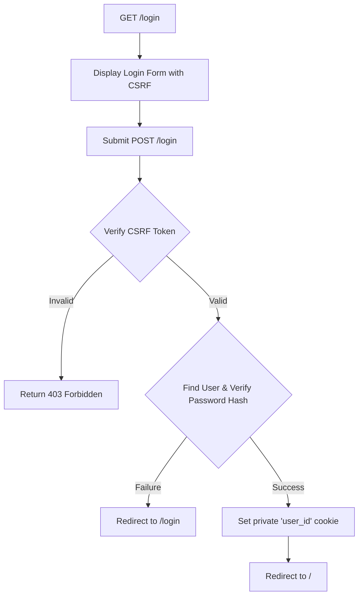
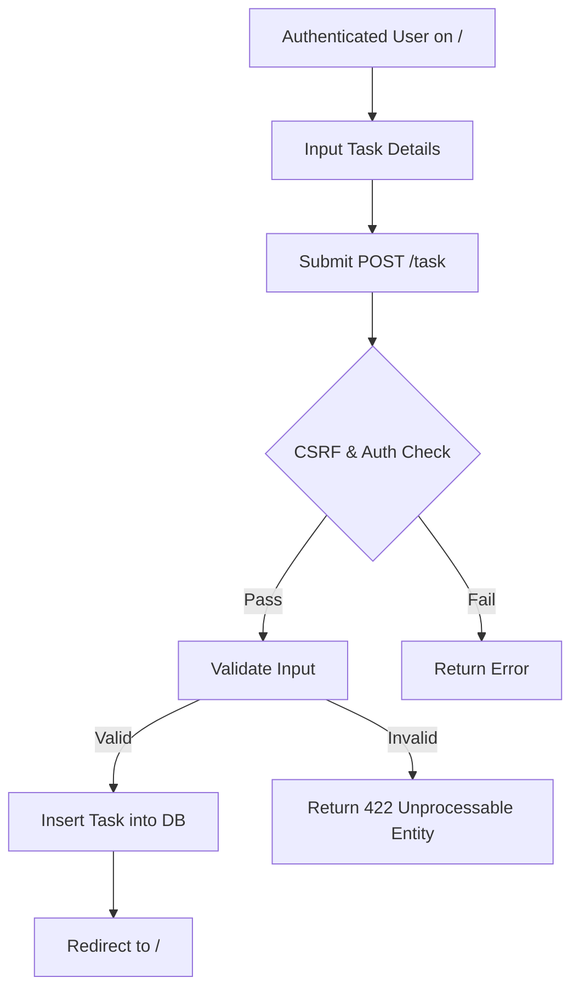

# Project Documentation: Rocket SQLite Task Tracker

This document provides a technical overview of the Rocket SQLite Task Tracker, including its architecture, data models, security features, and workflow diagrams.

## 1. Architecture Overview

The application follows a standard web server architecture using the following technologies:

- **Language**: [Rust](https://www.rust-lang.org/)
- **Web Framework**: [Rocket (v0.5.1)](https://rocket.rs/) - Utilizes asynchronous request handling, type-safe routing, and request guards.
- **Database**: [SQLite](https://www.sqlite.org/) - Managed via `rusqlite` and `rocket_sync_db_pools`.
- **Database Migrations**: [Refinery](https://github.com/rust-db/refinery) - Handles automated schema migrations on startup.
- **Templating Engine**: [Tera](https://tera.netlify.app/) - Server-side rendering for HTML pages.
- **Styling**: [Tailwind CSS](https://tailwindcss.com/) & [Flowbite](https://flowbite.com/) - Modern, responsive UI components.
- **Authentication**: Private cookies and `bcrypt` for password hashing.
- **Date Handling**: [Chrono](https://github.com/chronotope/chrono) - Manages task dates and calculates urgency/expiration.

## 2. Data Models

### User
Represents a registered user in the system.
- `id`: Unique identifier (Primary Key).
- `username`: Unique username for login.
- `password_hash`: Bcrypt hashed password.

### Task
Represents a task created by a user.
- `id`: Unique identifier (Primary Key).
- `name`: Task description (1-255 characters).
- `status`: `New` or `Done`.
- `date`: ISO date string (YYYY-MM-DD).
- `user_id`: Foreign key referencing the `User`.
- `is_urgent`: (Dynamic) True if the task is due today or tomorrow.
- `is_expired`: (Dynamic) True if the task is past due and not marked as `Done`.

## 3. Security Measures

The application implements several security best practices:

- **CSRF Protection**: A Synchronized Token Pattern is used. A unique UUID token is stored in a `csrf_token` cookie and must be submitted with all state-changing requests (POST). For JSON requests, the `X-CSRF-Token` header is checked.
- **Authentication Guards**: The `AuthUser` request guard ensures that protected routes are only accessible by authenticated users.
- **Input Validation**: Rocket's form and JSON validation are used to enforce constraints (e.g., task name length).
- **Security Headers**: A custom fairing (`SecurityHeaders`) injects OWASP-recommended headers into every response:
  - `Content-Security-Policy` (CSP)
  - `Strict-Transport-Security` (HSTS)
  - `X-Frame-Options: DENY`
  - `X-Content-Type-Options: nosniff`
  - `Referrer-Policy`
- **Password Security**: Passwords are never stored in plain text; they are hashed using `bcrypt`.
- **User Isolation**: All task-related queries are scoped to the `user_id` of the authenticated user.

## 4. Flow Diagrams

### 4.1 Request Lifecycle
The following diagram illustrates how a request is processed through the system.

### 4.2 Authentication Flow
The login process for users.

### 4.3 Task Management Flow
Creating and managing tasks.

## 5. Route Reference

| Method | Route | Access | Description |
|---|---|---|---|
| GET | `/` | Guest/Auth | Dashboard (Auth) or Landing Page (Guest) |
| GET | `/login` | Guest | Login page |
| POST | `/login` | Guest | Handle login credentials |
| POST | `/logout` | Auth | Terminate session |
| GET | `/tasks` | Auth | Get tasks in JSON format (supports sort/page) |
| POST | `/tasks` | Auth | Create a task via JSON |
| POST | `/task` | Auth | Create a task via Form |
| GET | `/task/<id>` | Auth | View task details |
| GET | `/task/<id>/edit`| Auth | Edit task form |
| POST | `/task/<id>` | Auth | Update task details |
| POST | `/task/<id>/delete`| Auth | Delete a task |
| GET | `/user_admin` | Admin | User management dashboard |
| POST | `/user_admin` | Admin | Create a new user |
| GET | `/user_admin/<id>/edit`| Admin | Edit user form |
| POST | `/user_admin/<id>`| Admin | Update user details |
| POST | `/user_admin/<id>/delete`| Admin | Delete a user |

## 6. Database Schema

### `users` Table
| Column | Type | Constraints |
|---|---|---|
| `id` | INTEGER | PRIMARY KEY, AUTOINCREMENT |
| `username` | TEXT | NOT NULL, UNIQUE |
| `password_hash` | TEXT | NOT NULL |

### `tasks` Table
| Column | Type | Constraints |
|---|---|---|
| `id` | INTEGER | PRIMARY KEY, AUTOINCREMENT |
| `name` | TEXT | NOT NULL |
| `status` | TEXT | NOT NULL (CHECK: 'new', 'done') |
| `date` | TEXT | NOT NULL (ISO-8601) |
| `user_id` | INTEGER | NOT NULL, FOREIGN KEY (users.id) |

---
*Documentation generated by Jules*
